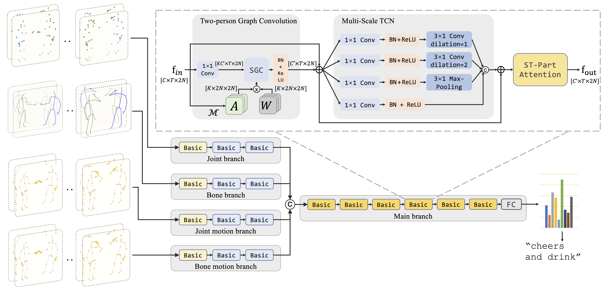

# Two-person Graph Convolutional Network (2P-GCN) for Human-human Interaction Recognition

## 1 Paper Details

Zhengcen Li, Yueran Li, Linlin Tang, Tong Zhang and Jingyong Su. **Two-person Graph Convolutional Network for Skeleton-based Human-human Interaction Recognition** [[Arxiv Preprint]](https://arxiv.org/abs/2208.06174)

The following pictures are the pipeline of 2P-GCN and the illustration of Basic block.
<div align="center">
    
</div>

## 2 Prerequisites

Our code is based on the EffGCN architecture (https://github.com/yfsong0709/EfficientGCNv1).

### 2.1 Libraries

This code is based on [Python3](https://www.anaconda.com/) (anaconda, >= 3.5) and [PyTorch](http://pytorch.org/) (>= 1.6.0).

Other Python libraries are presented in the **'scripts/requirements.txt'**, which can be installed by 
```
pip install -r scripts/requirements.txt
```

### 2.2 Experimental Dataset

**NTU RGB+D 60 & 120** datasets can be downloaded from 
[here](http://rose1.ntu.edu.sg/datasets/actionrecognition.asp). There are 302 samples of **NTU RGB+D 60** and 532 samples of **NTU RGB+D 120** need to be ignored, which are shown in the **'src/reader/ntu_ignore.txt'**.

For **SBU** dataset, please refer to [SBU-Kinect-Interaction dataset v2.0](http://vision.cs.stonybrook.edu/~kiwon/Datasets/SBU_Kinect_Interactions/README.txt). We use the clean version in our experiments. We have provided the preprocessed SBU dataset under `./data/sbu` directory.

## 3 Parameters

Before training and evaluating, there are some parameters should be noticed.

* (1) **'--config'** or **'-c'**: The path to configuration file. You must use this parameter in the command line or the program will output an error. 

* (2) **'--work_dir'** or **'-w'**: The path to workdir, for saving checkpoints and other running files. Default is **'./workdir'**.

* (3) **'--pretrained_path'** or **'-pp'**: The path to the pretrained models. **pretrained_path = None** means using randomly initial model. Default is **None**.

* (4) **'--resume'** or **'-r'**: Resume from the recent checkpoint (**'<--work_dir>/checkpoint.pth.tar'**).

* (5) **'--evaluate'** or **'-e'**: Only evaluate models. You can choose the evaluating model according to the instructions.

* (6) **'--dataset'** or **'-d'**: Choose the dataset. (Choice: **[ntu, ntu120, ntu-mutual, ntu120-mutual, sbu]**)

* (7) **'--model_type'** or **'-mt'**: Choose the model. (We implemented 3 models, 2P-GCN, ST-GCN and Efficient-GCN)

Parameters can be updated by modifying the corresponding config file in the **'configs'** folder or using command line to send parameters to the model, and the parameter priority is **command line > yaml config > default value**.


## 4 Running

### 4.1 Modify Configs

Firstly, you should modify the **'path'** parameters in all config files of the **'configs'** folder.

A python file **'scripts/modify_configs.py'** will help you to do this. You need only to change three parameters in this file to your path to NTU datasets.
```
python scripts/modify_configs.py --root_folder <path/to/save/numpy/data> --ntu60_path <path/to/ntu60/dataset> --ntu120_path <path/to/ntu120/dataset>
```
All the commands above are optional.

### 4.2 Generate Datasets

After modifing the path to datasets, please generate numpy datasets before trainning (only the first time to use this benchmark). It may takes a couple of minues.
```
python main.py -c <path-to-config> -gd
```
where `<path-to-config>` is the (absolute or relative) path  to the config file, e.g., `configs/2pgcn/ntu_mutual/baseline/xsub.yaml`.

For NTU-RGB+D dataset, if the `dataset` argument specifies `ntu_mutual`, the program will generate **ntu_mutual** dataset which only contains mutual actions; otherwise the whole NTU dataset will be generated.

For SBU dataset, we provide the preprocessed dataset under `./data/sbu` folder.
### 4.3 Train

You can simply train the model by 
```
python main.py -c <path-to-config>
```
For example
```
python main.py -c configs/2pgcn/sbu/symmetry/fold1.yaml

python main.py -c configs/2pgcn/ntu_mutual/baseline/xsub.yaml
```

### 4.4 Evaluate

Before evaluating, you should ensure that the trained model corresponding the config is already existed in the **<--pretrained_path>** or **'<--work_dir>'** folder. Then run
```
python main.py -c <path-to-config> -e
```

## 5 Results and Pretrained Models

We provide folowing pretrained models and their results

| Dataset            | Split  | Acc.   | Pretrained Path             |
| ------------------ | ------ | ------ | --------------------------- |
| NTU-Interaction    | X-Sub  | 97.06% | ntu_mutual-symmetry/xsub    |
| NTU-Interaction    | X-View | 98.99% | ntu_mutual-symmetry/xview   |
| NTU120-Interaction | X-Sub  | 93.68% | ntu_mutual-symmetry/xsub120 |
| NTU120-Interaction | X-Set  | 94.37% | ntu_mutual-symmetry/xset120 |

These models can be downloaded from [here](https://drive.google.com/drive/folders/1GnBfM0MXfsxNsG0dQyzamtYZNhnDm5UC?usp=sharing)

## 6 Citation
```
@ARTICLE{li20232PGCN,
  author={Li, Zhengcen and Li, Yueran and Tang, Linlin and Zhang, Tong and Su, Jingyong},
  journal={IEEE Transactions on Circuits and Systems for Video Technology}, 
  title={Two-Person Graph Convolutional Network for Skeleton-Based Human Interaction Recognition}, 
  year={2023},
  volume={33},
  number={7},
  pages={3333-3342},
  doi={10.1109/TCSVT.2022.3232373}
}
```